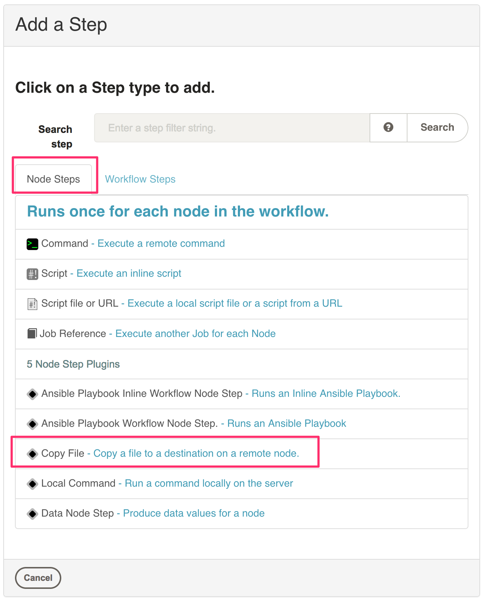
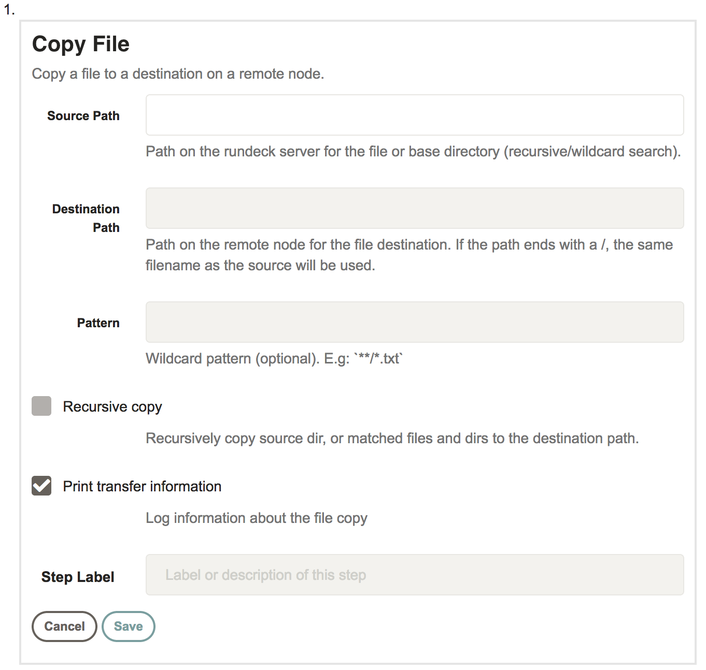

# Copy File Plugin

A Rundeck plugin that copies a file to a destination on a remote node.

### Configure

To use the copy file plugin, create a job and look at the Node step plugins list.
Click on the Copy File plugin.

Once selected, the plugin will prompt you to enter configuration values for this job.

 